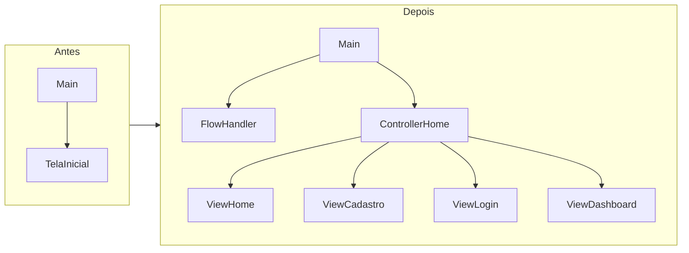
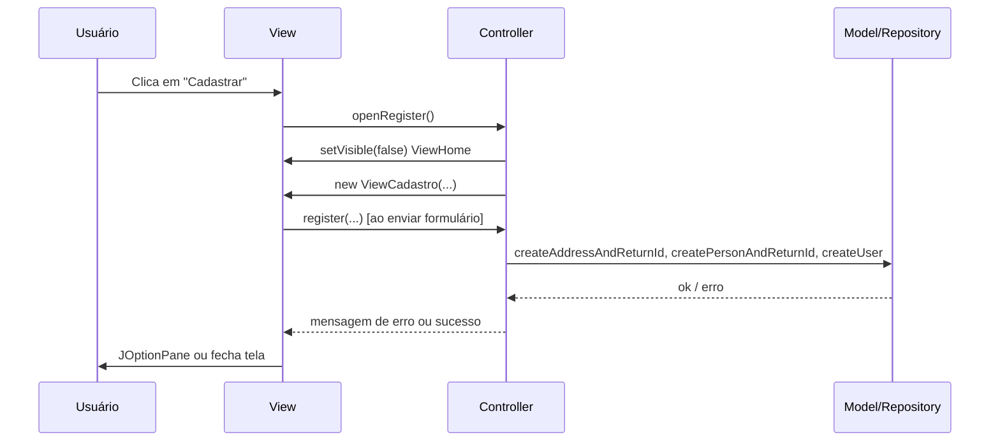
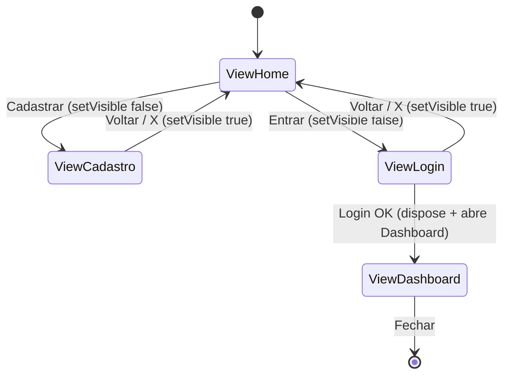
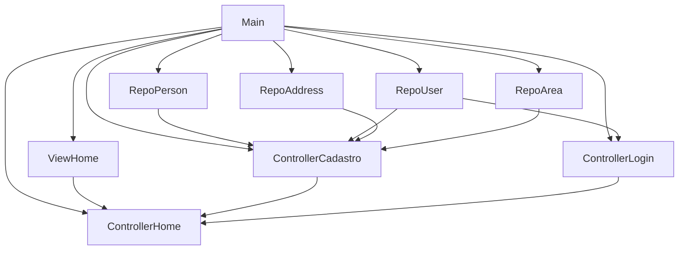
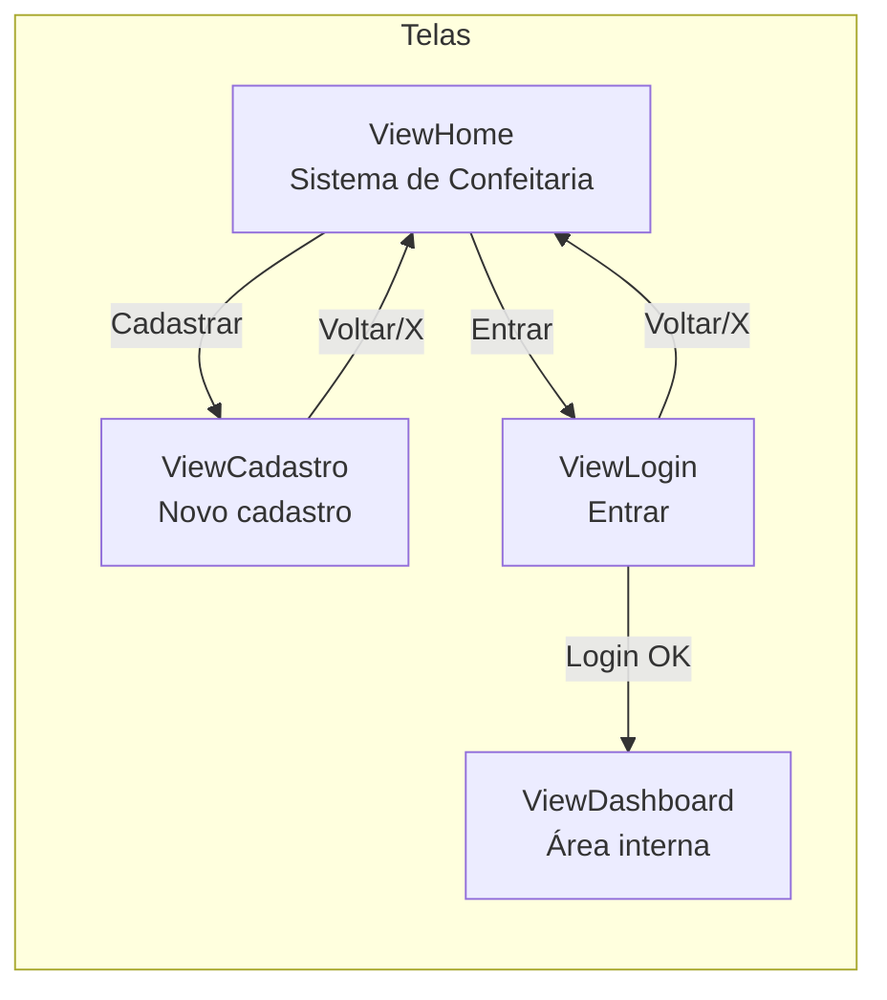
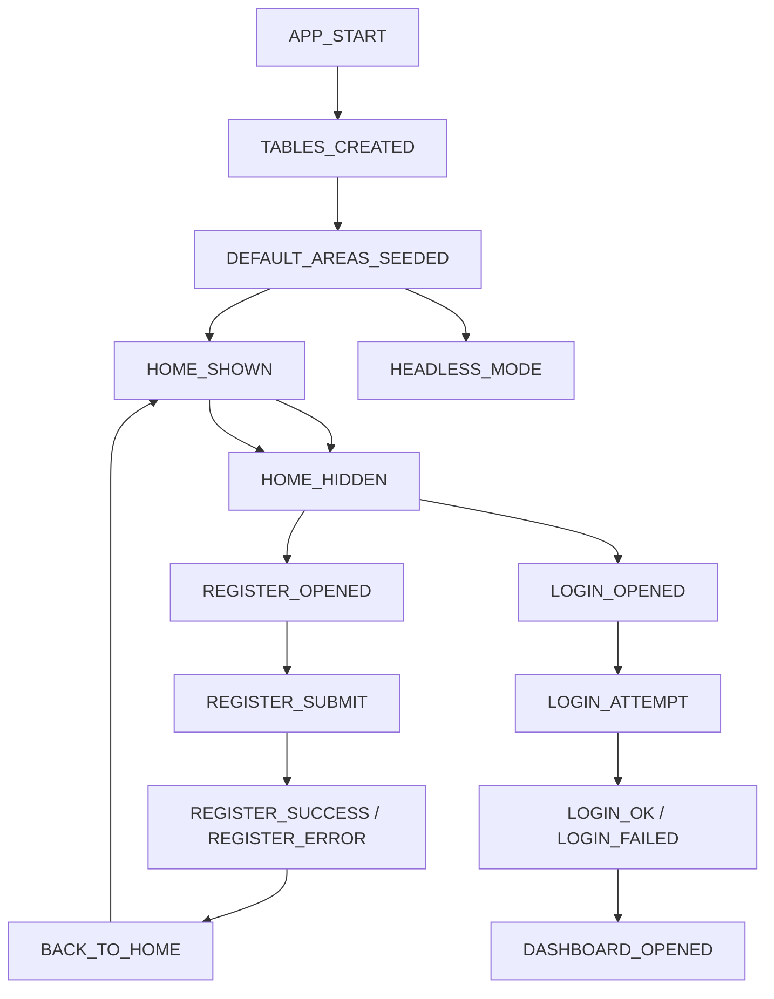
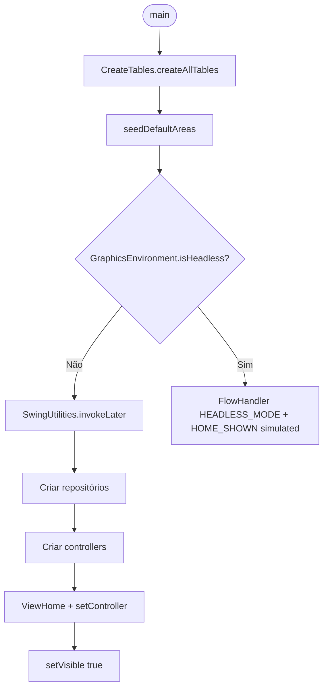
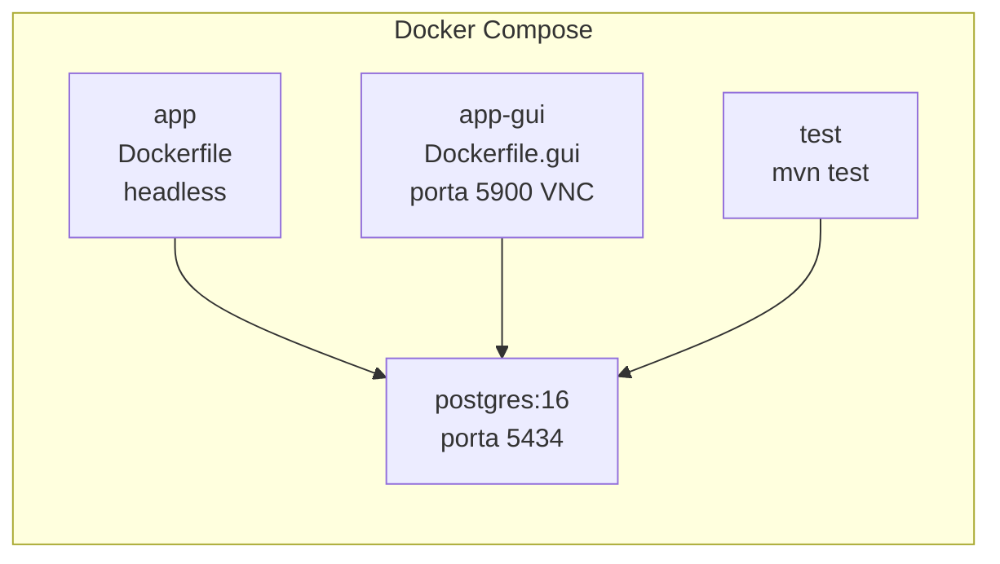
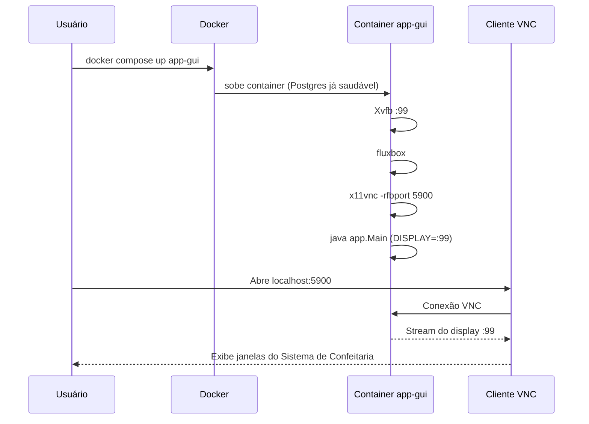

# 📋 Alterações realizadas no Sistema de Confeitaria

Documento minucioso de todas as mudanças feitas no projeto, com gráficos e fluxos.

---

## Índice

1. [Visão geral](#1-visão-geral)
2. [Arquitetura MVC e pacotes](#2-arquitetura-mvc-e-pacotes)
3. [Modelo (entities e repositories)](#3-modelo-entities-e-repositories)
4. [Controllers e injeção de dependência](#4-controllers-e-injeção-de-dependência)
5. [Views e tema (confeitaria)](#5-views-e-tema-confeitaria)
6. [FlowHandler e fluxo da aplicação](#6-flowhandler-e-fluxo-da-aplicação)
7. [Bootstrap (Main) e seed de áreas](#7-bootstrap-main-e-seed-de-áreas)
8. [Docker e GUI (VNC)](#8-docker-e-gui-vnc)
9. [Documentação e scripts](#9-documentação-e-scripts)

---

## 1. Visão geral

### Resumo das alterações por área

| Área | Alterações principais |
|------|------------------------|
| **Estrutura** | Nova pasta `view/`, nova pasta `controller/`, organização MVC |
| **Model** | `Area` com áreas de exemplo (Anápolis-GO), `RepositoryAddress.createAddressAndReturnId`, `RepositoryPerson.createPersonAndReturnId`, `CreateTables.seedDefaultArea` |
| **Controller** | `ControllerHome`, `ControllerCadastro`, `ControllerLogin` com injeção de dependência |
| **View** | `ViewHome`, `ViewCadastro`, `ViewLogin`, `ViewDashboard`, `ViewTheme`; métodos separados; tema confeitaria |
| **App** | `FlowHandler`, `Main` com bootstrap, seed de áreas, modo headless |
| **Docker** | `Dockerfile` (JDK, headless), `Dockerfile.gui` (Xvfb + VNC), serviço `app-gui` |
| **Docs/Scripts** | `testAndDocker.md` (WSL, VNC), `run-app-gui.sh`, `start-gui.sh` |

### Diagrama de alto nível (antes → depois)



---

## 2. Arquitetura MVC e pacotes

### Estrutura de pastas (packages)

```
src/
├── app/                    # Bootstrap e utilitários
│   ├── Main.java
│   └── FlowHandler.java
├── controller/             # Lógica dos botões e navegação
│   ├── ControllerHome.java
│   ├── ControllerCadastro.java
│   └── ControllerLogin.java
├── view/                   # Janelas (JFrame)
│   ├── ViewTheme.java
│   ├── ViewHome.java
│   ├── ViewCadastro.java
│   ├── ViewLogin.java
│   ├── ViewDashboard.java
│   └── TelaInicial.java    # Atalho para ViewHome
├── model/
│   ├── entities/
│   └── repositories/
└── services/
```

### Fluxo MVC (quem chama quem)



### Navegação entre telas



---

## 3. Modelo (entities e repositories)

### 3.1 Classe `Area.java`

**Alterações:**

- Lista estática **`DEFAULT_AREAS`** com bairros de **Anápolis-GO** e taxa de entrega (fee).
- Método estático **`getDefaultAreas()`** para uso no bootstrap (seed no banco).
- Indentação e estilo unificados (4 espaços); Javadoc; `toString()` usando campos diretos.

**Áreas de exemplo (Anápolis-GO):**

| Nome | Taxa (R$) |
|------|-----------|
| Centro | 0,00 |
| Jardim Bandeirante | 5,00 |
| Vila Norte | 5,00 |
| Residencial Ayrton Senna | 6,00 |
| Vale dos Pássaros | 6,00 |
| Granjas Santo Antônio | 7,00 |
| Residencial do Cerrado | 6,00 |
| Residencial Valência | 6,00 |
| Vila Nossa Senhora da Abadia | 5,00 |

### 3.2 `RepositoryAddress`

**Alteração:** novo método **`createAddressAndReturnId(Address)`**.

- Faz `INSERT` e retorna o **id** gerado (`Statement.RETURN_GENERATED_KEYS`).
- Usado no fluxo de cadastro: criar endereço → obter id → criar Person com `id_address`.

### 3.3 `RepositoryPerson`

**Alteração:** novo método **`createPersonAndReturnId(Person)`**.

- Faz `INSERT` com `RETURN_GENERATED_KEYS` e retorna o id da person.
- Usado no cadastro: criar Person → obter id → criar User com `id_person`.

### 3.4 `CreateTables.java`

**Alterações:**

- **`createTablePerson()`**: uso de try-with-resources para `Connection` e `Statement` (evitar vazamento de recurso).
- **`seedDefaultArea()`**: insere área "Centro" (fee 0) com `ON CONFLICT (name) DO NOTHING`; chamado ao final de `createAllTables()`.
- Ordem das tabelas mantida conforme FKs (area → address → person → …).

---

## 4. Controllers e injeção de dependência

### 4.1 Injeção de dependência

Todos os controllers passam a receber dependências pelo **construtor** (não instanciam repositórios com `new`).



### 4.2 `ControllerHome`

- **Construtor:** `ControllerHome(ViewHome, ControllerCadastro, ControllerLogin)`.
- **Métodos:** `openRegister()`, `openLogin()`, `backToHome()`, `onLoginSuccess(ViewLogin)`.
- Responsabilidade: esconder/mostrar ViewHome, abrir ViewCadastro/ViewLogin/ViewDashboard.

### 4.3 `ControllerCadastro`

- **Construtor:** `ControllerCadastro(RepositoryPerson, RepositoryUser, RepositoryAddress, RepositoryArea)`.
- **Métodos:** `isEmailAlreadyRegistered(email)`, `listAreas()`, `register(...)`.
- Validação em métodos auxiliares (`validateRequiredFields`, `persistUser`, `buildAddress`); retorno de erro com `Optional<String>`.

### 4.4 `ControllerLogin`

- **Construtor:** `ControllerLogin(RepositoryUser)`.
- **Método:** `login(email, password)` → retorna `User` ou `null`.
- Uso de `EncryptionService.checkPassword` para validar senha.

---

## 5. Views e tema (confeitaria)

### 5.1 Classe `ViewTheme`

Centraliza cores e fontes do sistema de confeitaria (paleta leve, “doce”):

| Constante | Uso |
|-----------|-----|
| `BACKGROUND` | Fundo creme (#FFF9F5) |
| `CARD_BG` | Fundo de cartões |
| `ACCENT` | Botão primário (dourado #B8860B) |
| `TEXT`, `TEXT_MUTED` | Texto principal e secundário |
| `BORDER` | Bordas suaves |
| `FONT_TITLE`, `FONT_SUBTITLE`, `FONT_LABEL`, `FONT_BUTTON` | Fontes (Segoe UI) |

**Métodos estáticos:** `createPanel`, `createTitleLabel`, `createSubtitleLabel`, `createFieldLabel`, `createPrimaryButton`, `createSecondaryButton`, `createTextField`, `createPasswordField`, `createSection`.

### 5.2 Organização das views em métodos

Cada view passou a ter a construção da tela dividida em métodos:

| View | Métodos principais |
|------|--------------------|
| **ViewHome** | `configureFrame()`, `buildMainPanel()`, `buildTitleSection()`, `buildButtonsSection()` |
| **ViewCadastro** | `configureFrame()`, `buildMainPanel()`, `buildTitleSection()`, `buildPersonalSection()`, `buildAddressSection()`, `buildAreaCombo()`, `addFieldRow()`, `buildButtonsSection()` |
| **ViewLogin** | `configureFrame()`, `buildMainPanel()`, `buildTitleSection()`, `buildFieldsSection()`, `buildButtonsSection()` |
| **ViewDashboard** | `configureFrame()`, `buildMainPanel()`, `buildWelcomeSection()`, `buildMessageSection()` |

### 5.3 ViewCadastro – seções

- **Dados pessoais:** Nome, Sobrenome, E-mail, Senha.
- **Endereço:** Área (combo com bairros de Anápolis-GO), Rua, Número, CEP, Complemento, Referência.
- Botões: Voltar (secundário), Cadastrar (primário).
- E-mail duplicado: controller verifica antes de salvar; em caso de duplicado, `JOptionPane` e tela não fecha.

### 5.4 Fluxo visual (telas)



---

## 6. FlowHandler e fluxo da aplicação

### 6.1 Objetivo

Registrar eventos de fluxo da aplicação em stdout, com prefixo `[FLOW]` e timestamp, para debug e acompanhamento (incluindo logs no Docker).

### 6.2 API

- `FlowHandler.log(String event)`
- `FlowHandler.log(String event, String detail)`
- `FlowHandler.log(String event, String... details)`

Formato da linha: `[FLOW] yyyy-MM-dd HH:mm:ss.SSS EVENTO | detalhe`. Uso de `System.out.flush()` para saída imediata.

### 6.3 Eventos registrados



| Evento | Onde é emitido |
|--------|-----------------|
| `APP_START` | Main, início |
| `TABLES_CREATED` | Main, após CreateTables |
| `DEFAULT_AREAS_SEEDED` | Main, após seedDefaultAreas |
| `HOME_SHOWN` | Main (ou HEADLESS_MODE + HOME_SHOWN simulated) |
| `HOME_HIDDEN` | ControllerHome (abrir Cadastro/Login) |
| `REGISTER_OPENED` | ControllerHome.openRegister |
| `REGISTER_SUBMIT` / `REGISTER_SUCCESS` / `REGISTER_ERROR` | ControllerCadastro.register |
| `LOGIN_OPENED` | ControllerHome.openLogin |
| `LOGIN_ATTEMPT` / `LOGIN_OK` / `LOGIN_FAILED` | ControllerLogin.login |
| `BACK_TO_HOME` | ControllerHome.backToHome |
| `DASHBOARD_OPENED` | ControllerHome.onLoginSuccess |

---

## 7. Bootstrap (Main) e seed de áreas

### 7.1 Fluxo do `Main.main`



### 7.2 `seedDefaultAreas()`

- Instancia `RepositoryArea`.
- Itera sobre `Area.getDefaultAreas()` e chama `repoArea.createArea(area)` para cada uma.
- Garante que as áreas de exemplo (Anápolis-GO) existam no banco ao subir a aplicação.

### 7.3 Modo headless (Docker sem VNC)

- Se `GraphicsEnvironment.isHeadless()` for `true` (ex.: container sem display), o Main não inicia Swing.
- Apenas registra `HEADLESS_MODE` e `HOME_SHOWN | simulated` e encerra, evitando erro de display.

---

## 8. Docker e GUI (VNC)

### 8.1 Serviços no `docker-compose.yml`



| Serviço | Imagem/Dockerfile | Uso |
|---------|--------------------|-----|
| **postgres** | postgres:16 | Banco confeitaria (admin/12345), porta 5434 no host |
| **app** | Dockerfile | App em modo headless (só logs de fluxo) |
| **app-gui** | Dockerfile.gui | App com display virtual (Xvfb) + VNC na porta 5900 |
| **test** | maven + volume | Executa `mvn test` no projeto |

### 8.2 Dockerfile (app headless)

- Build: Maven (Java 17).
- Runtime: `eclipse-temurin:17-jdk`.
- `JAVA_OPTS=-Djava.awt.headless=true` para rodar sem display no container.

### 8.3 Dockerfile.gui (app com telas via VNC)

- Build: mesmo estágio Maven do Dockerfile.
- Runtime: JDK + **Xvfb** (display virtual `:99`) + **x11vnc** (VNC na porta 5900) + **fluxbox** (gerenciador de janelas).
- **start-gui.sh**: inicia Xvfb, fluxbox, x11vnc (`-nopw`), define `DISPLAY=:99` e executa `java app.Main` (sem headless).

### 8.4 Fluxo “todo no Docker + ver telas”



---

## 9. Documentação e scripts

### 9.1 Arquivos criados ou alterados

| Arquivo | Tipo | Descrição |
|---------|------|-----------|
| **docs/testAndDocker.md** | Doc | Seção 0: rodar todo o projeto no Docker + VNC; 0.1: Docker pelo WSL; comandos para app-gui e alternativa app local |
| **docs/documentation.md** | Doc | Referências a testAndDocker, app-gui e WSL |
| **docs/ALTERACOES-DETALHADAS.md** | Doc | Este documento (alterações minuciosas + gráficos) |
| **run-app-gui.sh** | Script | Sobe Postgres no Docker, exporta DB_HOST/DB_PORT e roda `./mvnw exec:java` no host (telas no WSL/Windows) |
| **start-gui.sh** | Script | Usado dentro do container app-gui: inicia Xvfb, fluxbox, x11vnc e o app Java |

### 9.2 Comandos rápidos (WSL/Docker)

| Objetivo | Comando |
|----------|---------|
| Tudo no Docker, ver telas (VNC) | `docker compose up -d postgres` → `docker compose build app-gui` → `docker compose up app-gui` → cliente VNC em localhost:5900 |
| App no host, Postgres no Docker | `docker compose up -d postgres` → `export DB_HOST=127.0.0.1 DB_PORT=5434` → `./mvnw exec:java` ou `./run-app-gui.sh` |
| App headless (só fluxo) | `docker compose up -d postgres` → `docker compose up app` |
| Testes no Docker | `docker compose up -d postgres` → `docker compose run --rm test` |

---

## Resumo final

- **Estrutura:** MVC com pacotes `app`, `controller`, `view`, `model`, `services`.
- **Model:** Áreas de Anápolis-GO em `Area`, repositórios com métodos que retornam id (address, person), seed de áreas no Main.
- **Controller:** Injeção de dependência; navegação (home/cadastro/login/dashboard) e regras de cadastro/login nos controllers.
- **View:** ViewTheme (confeitaria), views refatoradas em métodos, seções e botões padronizados.
- **App:** FlowHandler para fluxo; Main com bootstrap, seed e modo headless.
- **Docker:** Serviço `app-gui` com Xvfb + VNC para rodar todo o projeto no Docker e abrir as telas via cliente VNC em localhost:5900.

Todas as alterações foram feitas para manter o sistema de confeitaria consistente, testável e documentado.
