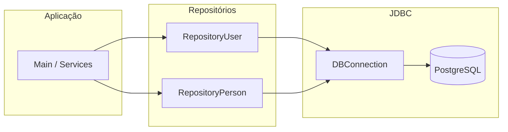

# Repository e JDBC – Documentação Detalhada

Documento completo: **JDBC** (o que é, arquitetura, APIs), **padrão Repository** (teoria e estrutura), **bibliotecas e métodos** usados no projeto e **código de referência** (RepositoryPerson).

---

## Parte 1 – JDBC (Java Database Connectivity)

### 1.1 O que é JDBC

**JDBC** é a API padrão da Java para acesso a bancos de dados relacionais. Ela permite que uma aplicação Java:

- Conecte a um banco (PostgreSQL, MySQL, H2, etc.).
- Envie comandos **SQL** (SELECT, INSERT, UPDATE, DELETE).
- Leia os resultados das consultas (linhas e colunas).

O JDBC não executa SQL diretamente: ele delega ao **driver** do banco. O driver é um JAR específico (ex.: `postgresql-*.jar`) que implementa a interface JDBC e se comunica com o servidor do banco.

### 1.2 Arquitetura em camadas

```text
Aplicação Java (Repository, Services)
         |
         v
   API JDBC (java.sql.*)
         |
         v
   Driver JDBC (ex.: PostgreSQL)
         |
         v
   Banco de dados (PostgreSQL)
```

- **Aplicação:** usa apenas as classes do pacote `java.sql` (e `javax.sql` quando necessário).
- **Driver:** fornecido pelo fabricante do banco; no projeto, o driver PostgreSQL é carregado (geralmente via classpath) e registrado no `DriverManager`.
- **URL de conexão:** identifica o banco. Formato típico: `jdbc:postgresql://host:porta/nome_do_banco`.

### 1.3 DriverManager e obtenção da conexão

A classe **`java.sql.DriverManager`** é o ponto de entrada para obter uma conexão. Ela:

- Mantém uma lista de drivers registrados.
- Dado uma URL, usuário e senha, escolhe um driver compatível e devolve um objeto **`Connection`**.

No projeto, a classe **`DBConnection`** encapsula isso:

```java
// DBConnection.getConnection() usa internamente:
DriverManager.getConnection(
    "jdbc:postgresql://127.0.0.1:5434/confeitaria",
    "admin",
    "12345"
);
```

A URL pode ser parametrizada (host, porta, nome do banco, usuário e senha) via variáveis de ambiente, como em `DBConnection`.

**Importante:** Uma `Connection` representa um canal stateful com o banco. Deve ser **fechada** quando não for mais usada (para liberar recursos no servidor). No código, isso é feito com **try-with-resources**.

### 1.4 Connection (java.sql.Connection)

**`Connection`** representa uma sessão com o banco. A partir dela você cria **statements** para executar SQL.

Métodos principais usados no repositório:

| Método | Descrição |
|--------|------------|
| `PreparedStatement prepareStatement(String sql)` | Cria um PreparedStatement com a SQL passada. O statement fica “pré-compilado” no driver e aceita placeholders `?`. |
| `void close()` | Fecha a conexão. Em try-with-resources isso é chamado automaticamente ao sair do bloco. |

Uso típico:

```java
try (Connection conn = DBConnection.getConnection()) {
    // usar conn para criar PreparedStatement e executar SQL
} // conn.close() é chamado aqui
```

### 1.5 Statement vs PreparedStatement

- **Statement:** executa SQL montada como String (concatenação). **Problema:** risco de **SQL injection** e menos eficiência quando a mesma SQL é executada várias vezes com parâmetros diferentes.
- **PreparedStatement:** a SQL tem **placeholders** `?`. Os valores são atribuídos com métodos `setInt(índice, valor)`, `setString(índice, valor)`, etc. O driver trata a escaping e a compilação da query. **Recomendado** para todo SQL com parâmetros.

Exemplo:

```java
// Placeholders: primeiro ? = 1, segundo ? = 2, etc.
String sql = "SELECT * FROM person WHERE id = ? AND email = ?";
PreparedStatement stmt = conn.prepareStatement(sql);
stmt.setInt(1, 10);      // primeiro ?
stmt.setString(2, "a@b.com");  // segundo ?
ResultSet rs = stmt.executeQuery();
```

Métodos do **PreparedStatement** usados no repositório:

| Método | Uso |
|--------|-----|
| `void setInt(int parameterIndex, int x)` | Define um `int` no placeholder na posição `parameterIndex` (1-based). |
| `void setString(int parameterIndex, String x)` | Define uma `String` no placeholder. |
| `int executeUpdate()` | Executa INSERT, UPDATE ou DELETE. Retorna o número de linhas afetadas. |
| `ResultSet executeQuery()` | Executa SELECT. Retorna um `ResultSet` com as linhas. |

### 1.6 ResultSet (java.sql.ResultSet)

**`ResultSet`** representa o resultado de um SELECT: um conjunto de linhas (e colunas). Ele funciona como um **cursor**: inicialmente posicionado antes da primeira linha.

| Método | Descrição |
|--------|------------|
| `boolean next()` | Avança o cursor para a próxima linha. Retorna `true` se existe uma linha atual, `false` se não há mais linhas. Deve ser chamado pelo menos uma vez para acessar a primeira linha. |
| `int getInt(String columnLabel)` | Lê o valor da coluna com o nome `columnLabel` na **linha atual** como `int`. |
| `String getString(String columnLabel)` | Lê o valor da coluna como `String`. |
| `double getDouble(String columnLabel)` | Lê o valor como `double`. |

O nome da coluna (`columnLabel`) é o alias ou o nome da coluna na tabela (ex.: `"id"`, `"first_name"`). O cursor **não** avança ao ler; apenas `next()` avança.

Exemplo de leitura de várias linhas:

```java
while (rs.next()) {
    int id = rs.getInt("id");
    String name = rs.getString("first_name");
    // montar entidade e adicionar à lista
}
```

O **ResultSet** também deve ser fechado; no projeto isso é feito com try-with-resources junto com a `Connection` e o `PreparedStatement`.

### 1.7 SQLException (java.sql.SQLException)

**`SQLException`** é a exceção lançada quando ocorre um erro na camada JDBC: falha de conexão, SQL inválido, violação de constraint, etc.

No repositório, os métodos públicos declaram **`throws SQLException`**. Assim, quem chama (serviço ou main) pode decidir se captura a exceção, encapsula em outra ou propaga. Não é boa prática engolir a exceção com `catch` vazio ou apenas `printStackTrace()` sem tratar.

### 1.8 Try-with-resources (fechamento automático)

Recursos que implementam **`AutoCloseable`** (como `Connection`, `PreparedStatement`, `ResultSet`) devem ser fechados. O **try-with-resources** (Java 7+) garante que `close()` seja chamado ao sair do bloco, mesmo em caso de exceção.

Sintaxe:

```java
try (Connection conn = DBConnection.getConnection();
     PreparedStatement stmt = conn.prepareStatement(SQL)) {
    // usar conn e stmt
} // close() em ordem inversa: stmt, depois conn
```

Vários recursos no mesmo `try ( ... )` são separados por `;`. Eles são fechados na ordem **inversa** da declaração. No repositório, sempre que há `ResultSet`, ele entra no try para ser fechado junto.

---

## Parte 2 – Padrão Repository

### 2.1 O que é o padrão Repository

O **Repository** é um padrão de projeto que **abstrai o acesso a dados**. A aplicação trabalha com **entidades** (objetos de domínio, como `User`, `Person`); o repositório é responsável por:

- Traduzir operações em **SQL** (INSERT, SELECT, UPDATE, DELETE).
- Converter linhas do banco (**ResultSet**) em objetos da entidade.
- Esconder detalhes de JDBC, nomes de tabelas e colunas do resto do código.

Assim, serviços e controllers chamam, por exemplo, `repository.findById(id)` ou `repository.create(person)` em vez de manipular Connection, PreparedStatement e ResultSet diretamente.

### 2.2 Por que usar

- **Separação de responsabilidades:** regras de negócio ficam fora da camada de acesso a dados.
- **Um único lugar para SQL:** todas as queries daquela entidade ficam no repositório; facilita manutenção e evolução do schema.
- **Testabilidade:** em testes, pode-se substituir o repositório por um mock ou implementação em memória.
- **Legibilidade:** o código de negócio fica mais claro (ex.: `userRepository.findByEmail(email)`).

### 2.3 Fluxo no projeto



### 2.4 Estrutura de um repositório no projeto

Cada repositório (ex.: `RepositoryUser`, `RepositoryPerson`) segue a mesma estrutura:

1. **Constantes SQL:** todas as queries em `private static final String` (ex.: `SQL_INSERT`, `SQL_FIND_BY_ID`, `SQL_FIND_BY_EMAIL`, `SQL_FIND_ALL`, `SQL_DELETE`), com Javadoc descrevendo a operação.
2. **Métodos públicos:** `create`, `delete`, `findById`, `findByEmail`, `findAll` (nomes podem variar, ex.: `createUser`, `findByIdPerson`).
3. **Método privado de mapeamento:** `mapResultSetToEntity(ResultSet rs)` — recebe o ResultSet já posicionado em uma linha (após `next()`), lê as colunas, instancia a entidade, preenche com setters e retorna. **Não** chama `next()`.
4. **Recursos:** uso sistemático de try-with-resources para `Connection`, `PreparedStatement` e `ResultSet`.
5. **Exceções:** métodos públicos declaram `throws SQLException`; não engolem a exceção.

---

## Parte 3 – Bibliotecas utilizadas (resumo)

| Pacote / Classe | Papel no repositório |
|-----------------|----------------------|
| `java.sql.DriverManager` | Obtém `Connection` a partir da URL, usuário e senha (usado em `DBConnection`). |
| `java.sql.Connection` | Sessão com o banco; cria `PreparedStatement`; deve ser fechada. |
| `java.sql.PreparedStatement` | Executa SQL com `?`; `setInt`, `setString`; `executeUpdate()` (INSERT/UPDATE/DELETE) ou `executeQuery()` (SELECT). |
| `java.sql.ResultSet` | Cursor sobre o resultado do SELECT; `next()`, `getInt("col")`, `getString("col")`, etc. |
| `java.sql.SQLException` | Exceção de erro JDBC; declarada em `throws` nos métodos do repositório. |
| `java.util.List` | Tipo de retorno de `findAll()` (lista de entidades). |
| `java.util.ArrayList` | Implementação de `List` usada para acumular os objetos em `findAll()`. |

---

## Parte 4 – Métodos do repositório (detalhados)

### 4.1 create(entity)

- **Objetivo:** inserir uma nova linha na tabela.
- **Fluxo:** abre Connection e PreparedStatement com a SQL de INSERT; preenche os placeholders com os getters da entidade; chama `executeUpdate()`; retorna `rowsAffected > 0`.
- **SQL:** INSERT com colunas e `?` para cada valor. Pode incluir `ON CONFLICT ... DO NOTHING` (PostgreSQL) para evitar erro em chave/unique duplicada.
- **Exceção:** propaga `SQLException`.

Trecho de código (exemplo para Person):

```java
public boolean createPerson(Person person) throws SQLException {
    try (Connection conn = DBConnection.getConnection();
         PreparedStatement stmt = conn.prepareStatement(SQL_INSERT)) {
        stmt.setString(1, person.getFirstName());
        stmt.setString(2, person.getLastName());
        stmt.setString(3, person.getEmail());
        stmt.setInt(4, person.getAddress().getInteger());
        int rowsAffected = stmt.executeUpdate();
        return rowsAffected > 0;
    }
}
```

### 4.2 delete(entity)

- **Objetivo:** remover uma linha pelo id.
- **Fluxo:** abre Connection e PreparedStatement com SQL DELETE WHERE id = ?; faz `setInt(1, entity.getId())`; chama `executeUpdate()`; retorna `rowsAffected > 0`.
- **Exceção:** propaga `SQLException`.

```java
public boolean deletePerson(Person person) throws SQLException {
    try (Connection conn = DBConnection.getConnection();
         PreparedStatement stmt = conn.prepareStatement(SQL_DELETE)) {
        stmt.setInt(1, person.getId());
        int rowsAffected = stmt.executeUpdate();
        return rowsAffected > 0;
    }
}
```

### 4.3 findById(id)

- **Objetivo:** buscar uma única entidade pelo id.
- **Fluxo:** abre Connection e PreparedStatement com SELECT WHERE id = ?; `setInt(1, id)`; `executeQuery()`; try-with-resources no ResultSet; uma chamada a `rs.next()` — se retornar true, chama `mapResultSetToEntity(rs)` e retorna o objeto; senão retorna null.
- **Exceção:** propaga `SQLException`.

```java
public Person findByIdPerson(Integer id) throws SQLException {
    try (Connection conn = DBConnection.getConnection();
         PreparedStatement stmt = conn.prepareStatement(SQL_FIND_BY_ID)) {
        stmt.setInt(1, id);
        try (ResultSet rs = stmt.executeQuery()) {
            return rs.next() ? mapResultSetToPerson(rs) : null;
        }
    }
}
```

### 4.4 findByEmail(email)

- **Objetivo:** buscar uma única entidade por email (útil quando email é UNIQUE).
- **Fluxo:** igual ao findById, mas o parâmetro é String e a SQL usa WHERE email = ?; `setString(1, email)`.
- **Exceção:** propaga `SQLException`.

```java
public Person findByEmailPerson(String email) throws SQLException {
    try (Connection conn = DBConnection.getConnection();
         PreparedStatement stmt = conn.prepareStatement(SQL_FIND_BY_EMAIL)) {
        stmt.setString(1, email);
        try (ResultSet rs = stmt.executeQuery()) {
            return rs.next() ? mapResultSetToPerson(rs) : null;
        }
    }
}
```

### 4.5 findAll()

- **Objetivo:** retornar todas as linhas da tabela como lista de entidades.
- **Fluxo:** abre Connection, PreparedStatement e ResultSet (SELECT sem WHERE); em um `while (rs.next())` chama `mapResultSetToEntity(rs)` e adiciona a uma `ArrayList`; retorna a lista (nunca null; pode ser vazia).
- **Exceção:** propaga `SQLException`.

```java
public List<Person> findAllPerson() throws SQLException {
    List<Person> list = new ArrayList<>();
    try (Connection conn = DBConnection.getConnection();
         PreparedStatement stmt = conn.prepareStatement(SQL_FIND_ALL);
         ResultSet rs = stmt.executeQuery()) {
        while (rs.next()) {
            list.add(mapResultSetToPerson(rs));
        }
    }
    return list;
}
```

### 4.6 mapResultSetToEntity(ResultSet rs)

- **Objetivo:** converter a **linha atual** do ResultSet em um objeto da entidade.
- **Visibilidade:** privado; detalhe de implementação do repositório.
- **Contrato:** o chamador já posicionou o cursor com `next()`. Este método **não** chama `next()`; apenas lê colunas da linha atual com `getInt("col")`, `getString("col")`, etc., instancia a entidade, chama os setters e retorna.
- **Nomes das colunas:** devem coincidir com o schema (ex.: `first_name`, `id_address`). Em JOINs, usar alias se houver ambiguidade.

```java
private Person mapResultSetToPerson(ResultSet rs) throws SQLException {
    Person person = new Person();
    person.setId(rs.getInt("id"));
    person.setFirstName(rs.getString("first_name"));
    person.setLastName(rs.getString("last_name"));
    person.setEmail(rs.getString("email"));
    person.setAddress(null); // ou preencher Address se tiver setId
    return person;
}
```

---

## Parte 5 – Aplicação ao RepositoryPerson

- **Tabela `person`:** colunas `id` (SERIAL), `first_name`, `last_name`, `email` (UNIQUE), `id_address` (FK para `address(id)`).
- **Entidade Person:** atributos `id`, `firstName`, `lastName`, `email`, `Address address`.
- **createPerson:** exige `person.getAddress() != null` e o id do endereço (ex.: `person.getAddress().getInteger()`) para preencher `id_address`.
- **mapResultSetToPerson:** mapear `id`, `first_name`, `last_name`, `email`. Para `id_address`, pode-se deixar `setAddress(null)` ou, se a classe Address tiver `setId(Integer)`, criar um Address só com id e setar em person.
- **ON CONFLICT:** na inserção pode-se usar `ON CONFLICT (email) DO NOTHING` (PostgreSQL), pois `email` é UNIQUE.

---

## Parte 6 – Código completo do RepositoryPerson

Implementação de referência seguindo o padrão do projeto (JDBC, constantes SQL, Javadoc, try-with-resources e método privado de mapeamento).

```java
package model.repositories;

import model.entities.Person;

import java.sql.Connection;
import java.sql.PreparedStatement;
import java.sql.ResultSet;
import java.sql.SQLException;
import java.util.ArrayList;
import java.util.List;

/**
 * Repositório responsável pela persistência e consulta de pessoas
 * na tabela {@code person}. Abstrai o acesso a dados via JDBC.
 * A tabela person referencia {@code address} via id_address.
 */
public class RepositoryPerson {

    /**
     * INSERT na tabela person. Em caso de conflito em email (UNIQUE),
     * a linha não é inserida (ON CONFLICT DO NOTHING).
     * Exige que o endereço já exista (id_address = address.id).
     */
    private static final String SQL_INSERT =
            "INSERT INTO person(first_name, last_name, email, id_address) VALUES (?,?,?,?) "
            + "ON CONFLICT (email) DO NOTHING";

    /**
     * SELECT por id.
     */
    private static final String SQL_FIND_BY_ID =
            "SELECT id, first_name, last_name, email, id_address FROM person WHERE id = ?";

    /**
     * SELECT por email.
     */
    private static final String SQL_FIND_BY_EMAIL =
            "SELECT id, first_name, last_name, email, id_address FROM person WHERE email = ?";

    /**
     * SELECT de todos os registros.
     */
    private static final String SQL_FIND_ALL =
            "SELECT id, first_name, last_name, email, id_address FROM person";

    /**
     * DELETE por id.
     */
    private static final String SQL_DELETE = "DELETE FROM person WHERE id = ?";

    /**
     * Insere uma nova person. O endereço deve já existir (person.getAddress().getInteger() != null).
     * Se o email já existir, nenhuma linha é inserida.
     *
     * @param person pessoa a ser persistida (não nula; getAddress() e id do endereço não nulos)
     * @return true se pelo menos uma linha foi inserida, false caso contrário (ex.: email duplicado)
     * @throws SQLException em erro de acesso ao banco
     */
    public boolean createPerson(Person person) throws SQLException {
        try (Connection conn = DBConnection.getConnection();
             PreparedStatement stmt = conn.prepareStatement(SQL_INSERT)) {
            stmt.setString(1, person.getFirstName());
            stmt.setString(2, person.getLastName());
            stmt.setString(3, person.getEmail());
            stmt.setInt(4, person.getAddress().getInteger());
            int rowsAffected = stmt.executeUpdate();
            return rowsAffected > 0;
        }
    }

    /**
     * Remove uma person pelo id.
     *
     * @param person pessoa a ser removida (getId() = id da tabela person)
     * @return true se pelo menos uma linha foi removida
     * @throws SQLException em erro de acesso ao banco
     */
    public boolean deletePerson(Person person) throws SQLException {
        try (Connection conn = DBConnection.getConnection();
             PreparedStatement stmt = conn.prepareStatement(SQL_DELETE)) {
            stmt.setInt(1, person.getId());
            int rowsAffected = stmt.executeUpdate();
            return rowsAffected > 0;
        }
    }

    /**
     * Busca person pelo identificador.
     *
     * @param id identificador da pessoa
     * @return a pessoa encontrada ou null se não existir
     * @throws SQLException em erro de acesso ao banco
     */
    public Person findByIdPerson(Integer id) throws SQLException {
        try (Connection conn = DBConnection.getConnection();
             PreparedStatement stmt = conn.prepareStatement(SQL_FIND_BY_ID)) {
            stmt.setInt(1, id);
            try (ResultSet rs = stmt.executeQuery()) {
                return rs.next() ? mapResultSetToPerson(rs) : null;
            }
        }
    }

    /**
     * Busca person pelo email.
     *
     * @param email email da pessoa
     * @return a pessoa encontrada ou null se não existir
     * @throws SQLException em erro de acesso ao banco
     */
    public Person findByEmailPerson(String email) throws SQLException {
        try (Connection conn = DBConnection.getConnection();
             PreparedStatement stmt = conn.prepareStatement(SQL_FIND_BY_EMAIL)) {
            stmt.setString(1, email);
            try (ResultSet rs = stmt.executeQuery()) {
                return rs.next() ? mapResultSetToPerson(rs) : null;
            }
        }
    }

    /**
     * Lista todas as pessoas.
     *
     * @return lista de pessoas (nunca null, pode ser vazia)
     * @throws SQLException em erro de acesso ao banco
     */
    public List<Person> findAllPerson() throws SQLException {
        List<Person> list = new ArrayList<>();
        try (Connection conn = DBConnection.getConnection();
             PreparedStatement stmt = conn.prepareStatement(SQL_FIND_ALL);
             ResultSet rs = stmt.executeQuery()) {
            while (rs.next()) {
                list.add(mapResultSetToPerson(rs));
            }
        }
        return list;
    }

    /**
     * Mapeia a linha atual do ResultSet para um objeto Person.
     * Não avança o cursor; espera-se que o chamador tenha posicionado com next().
     *
     * @param rs ResultSet posicionado na linha desejada
     * @return instância de Person preenchida com os dados da linha
     * @throws SQLException em erro ao ler colunas
     */
    private Person mapResultSetToPerson(ResultSet rs) throws SQLException {
        Person person = new Person();
        person.setId(rs.getInt("id"));
        person.setFirstName(rs.getString("first_name"));
        person.setLastName(rs.getString("last_name"));
        person.setEmail(rs.getString("email"));
        person.setAddress(null);
        return person;
    }
}
```

**Observação:** A entidade `Address` no projeto possui `getInteger()` para o id e não possui `setId(Integer)`. Por isso em `createPerson` usamos `getAddress().getInteger()` e em `mapResultSetToPerson` usamos `setAddress(null)`. Se adicionar `setId(Integer)` e `getId()` em Address, pode preencher o address no mapeamento com um Address apenas com id.
